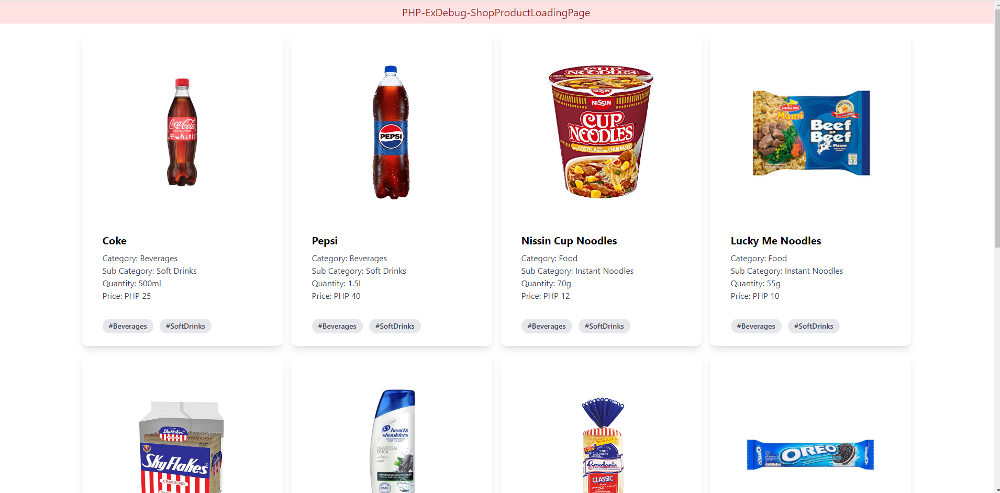

# PHP-ExDebug-ShopProductLoadingPage

This is a PHP practical exercise where you have to debug the program to make it work. Find as many bugs as possible. Find some hints from the README.md. This assumes you know vanilla php (plain php programming code) and jquery (a javascript plugin).

## Actual Website Display



## Instructions

- Clone the repository in your favorite php web server (Wamp, xamp, laragon, or herd)
```
git clone https://github.com/dvxgit-jsoriano/PHP-ExDebug-ShopProductLoadingPage.git
```
- Go to the folder, then go fix the bugs!
- Submit your answers by creating a branch with your name, commit and then push.
- Example:
```
git checkout -b JSoriano
git add --all
git commit -m "Fixed errors and bugs"
git push -u origin JSoriano
```

- <b>STRICTLY: NO CHEATING! NO CHATGPT OR ANY AI!</b>

## Bug Find and Fix

- There are about errors and bugs in this simple program. Find them and fix the errors and bugs. Let the hunt begin!

